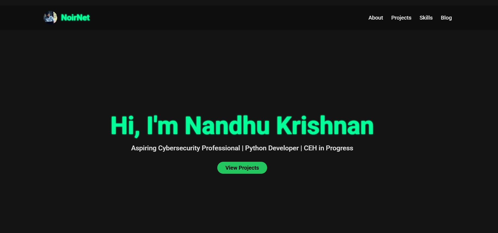
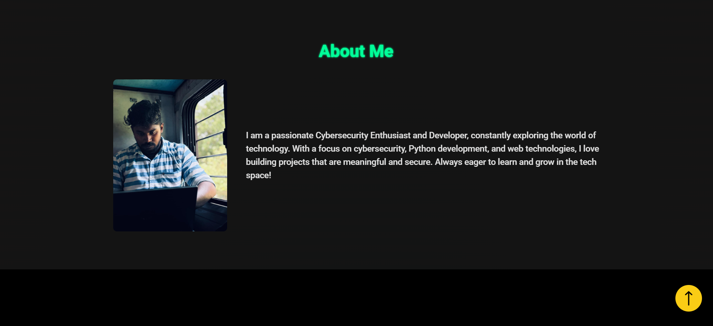
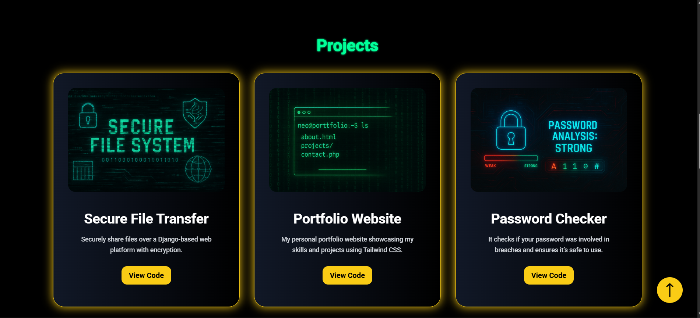
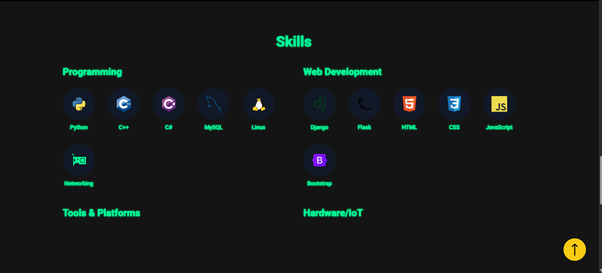
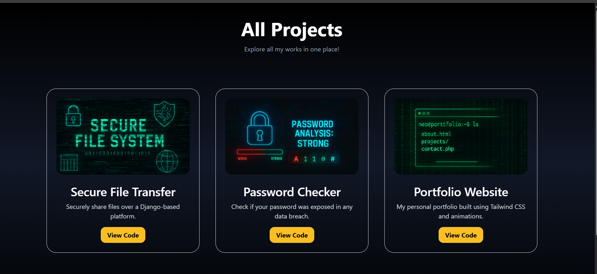

# 🚀 Personal Portfolio Website

Welcome to my personal portfolio website!  
Built to showcase my skills, projects, blogs, and passion for cybersecurity and development.

---

## ✨ Features

- ⚡ Modern, Responsive Design (Mobile-Friendly)
- 🌟 Animated Scroll Effects (AOS Library)
- 🖼️ Blog Section with Future Expandability
- 🎯 About Me Section with a Professional Touch
- ⬆️ Smooth "Back to Top" Button
- 📂 Fully Organized Codebase (HTML, CSS, TailwindCSS)

---

## 🔥 Technologies Used

- **HTML5**
- **TailwindCSS**
- **AOS (Animate on Scroll) Library**
- **JavaScript** (for minor interactivity)

---

## 📸 Screenshots

# Screenshots

## Home Page



## About



## Project



## Skills



## All Project




---

## 📚 What I Learned

- Building fully responsive layouts with **TailwindCSS**
- Enhancing UX with smooth scroll and animations
- Designing clean and minimal professional web interfaces
- Organizing a real-world project structure for deployment

---

## 🚀 Live Demo

Check out the live website here: [Portfolio Live Link](https://noirnetnandhu.netlify.app/)

---

## 🛠️ Installation & Setup

```bash
# Clone the repository
git clone https://github.com/CoderNandhu/Portfolio-wbsite.git

# Open index.html directly in your browser
